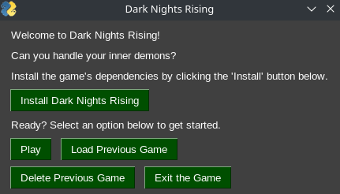

## Dark Nights Rising Open Source TTS Game

### Thanks for checking out **_Dark Nights Rising_!**


##### The welcome screen from the game's Python port. 

This is a game that harkens back to the older days of text adventure games (for example, **_Oregon Trail_**). These games were tons of fun, and evoked your imagination - as they had no real graphics of any substance, their stories and the way they pulled you into their world was what got you into those games. 

**_Dark Nights Rising_** is text-to-speech, and also sports some original music as the "soundtrack" to the game to give it a deeper feel. The game is about fighting the demons inside of yourself, and conceptualizes some abstract ideas I have thought about (and struggled with) in my own life. 

The game is written almost entirely in **Bash**, with a **Python** port being developed in parallel. 

### ===

### How Does it Work? 

**_Dark Nights Rising_** is currently playable in its early state on GNU/Linux distributions. Right now, the scripts are dependent on Debian-based distributions since that is what I develop on, but eventually the aim is to support all distros, and indeed, other platforms such as \*BSD, Windows, and macOS. 

I also plan to optimize it for Linux-based mobile phones, using my PinePhone as a testing ground. 

If you want to give it a go on your own system, simply ```git clone``` this repo: 

``` git clone https://github.com/rav3ndust/DarkNightsRising ```

Then, change directories to the new game folder and make the installer script executable:  

``` cd DarkNightsRising && chmod +x installer.sh ``` 

Next, run the installer script: 

``` ./installer.sh ``` 

Assuming there are no errors after the installer has finished, you will be able to call **_Dark Nights Rising_** from anywhere in your terminal simply by running ```darknightsrising```. 

Enjoy! Note that it is not currently finished, but you can play through the scenes that are available to get an idea for what the idea is like. 

### ===

### System dependencies 

**Dark Nights Rising** aims to be light and not use too many dependencies. However, like most programs these days, we have to bloat it up a little bit. To that end, I still am trying to keep everything minimal. 

Right now, the game relies on *dialog* for displaying messages to the user. *flite* takes care of the text-to-speech functions, while *mpg123* handles playing the game's soundtrack. A Python port is also underway as a side project, which depends (so far) on *python3* and *SimplePyGUI*. 

### ===

### Contributing

If you have any ideas, please feel free to contribute them to this game! You can always submit a pull request to the [Dark Nights Rising testing repo](https://github.com/rav3ndust/DarkNightsRising/tree/dev) if you have something cool to add. 

### ===

### Assorted Notes 

Please note that this game is a side project of mine with absolutely zero funding, and no promise of scheduled times that I might be working on it. However, I will be working on it periodically as time goes on and I always welcome pull requests or [cryptocurrencies](https://rav3ndust.xyz/contribute.html) for anyone who feels compelled to help out for some reason. 

### === 

[My website](https://rav3ndust.xyz) | [Connect with me on Neighborli](https://neighborli.xyz/@rav3ndust) | [My Github](https://github.com/rav3ndust) 
